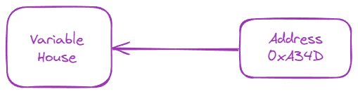
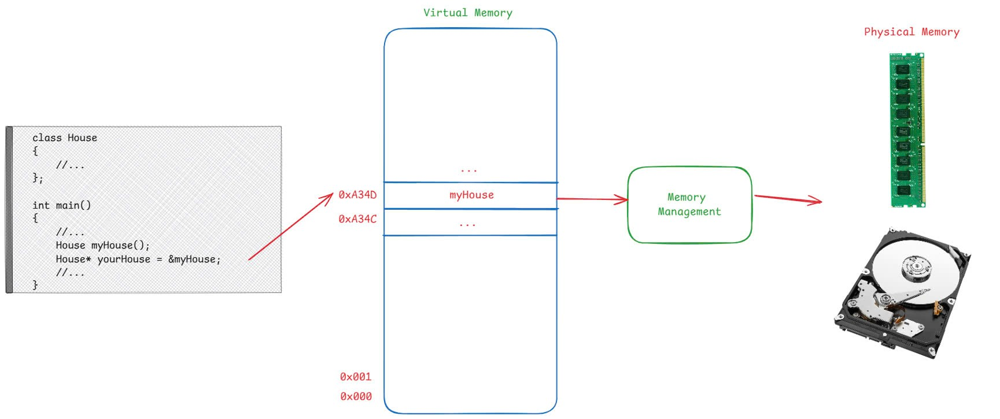

## Mục lục
- [Giới thiệu](#giới-thiệu)
- [Cách khai báo và sử dụng con trỏ](#cách-khai-báo-và-sử-dụng-con-trỏ)
    - [Khai báo con trỏ]()
    - [Lấy địa chỉ biến (&) và khái niệm Reference]()
    - [Truy xuất giá trị qua con trỏ (*)]()
    - [Con trỏ null]()
- [Các loại con trỏ phổ biến](#các-loại-con-trỏ-phổ-biến)
    - [Con trỏ hàm (Function Pointer)]()
    - [Con trỏ hằng (Constant Pointer) và Con trỏ trỏ tới hằng (Pointer to Constant)]()
    - [Con trỏ void (Void Pointer)]()
    - [Con trỏ thông minh (Smart Pointer)]()
- [Những lỗi thường gặp và mẹo tránh lỗi](#những-lỗi-thường-gặp-và-mẹo-tránh-lỗi)
    - [Con trỏ không được khởi tạo]()
    - [Truy cập ngoài vùng nhớ]()
    - [Rò rỉ bộ nhớ (Memory leak)](#rò-rỉ-bộ-nhớ-memory-leak)
    - [Lẫn lộn giữa `*` và `&`]()
- [Kết luận](#kết-luận)
---


## Giới thiệu
Con trỏ (pointer) là một trong những khái niệm trọng tâm trong lập trình C++. Về bản chất, con trỏ là **một biến** có khả năng lưu giữ địa chỉ của một biến khác trong bộ nhớ. Hình dung một cách đơn giản, bạn có thể liên tưởng một biến thông thường giống như ngôi nhà, còn con trỏ là “địa chỉ nhà”. Chỉ cần biết địa chỉ này, chúng ta có thể “tìm đến” biến gốc bất cứ lúc nào để đọc hoặc sửa đổi giá trị của nó, tùy theo nhu cầu.

 


 Ví dụ:

```cpp
House myHouse;
```

Khi thực hiện dòng lệnh này, một vùng nhớ kích thước `sizeof(House)` được cấp phát, và vùng nhớ đó sẽ được ghi lại với một địa chỉ nào đó. Giả sử địa chỉ đó là `0xA34D` (lưu ý đây là địa chỉ ảo của chương trình). Bất cứ khi nào chương trình cần sử dụng giá trị `myHouse` thì chương trình sẽ lấy giá trị thông qua địa chỉ `0xA34D`

#### Virtual Memory và Physical Memory?

Từ góc độ lập trình C++, mỗi con trỏ mà bạn khai báo và sử dụng thực chất là đang lưu trữ địa chỉ ảo (virtual address)



Nói cách khác, **mã nguồn C++ của bạn chỉ làm việc với các con trỏ ảo**. Lúc chạy, khi CPU cần truy cập biến `a`, nó sẽ gửi địa chỉ ảo tới MMU. MMU sẽ dùng bảng trang (page table) để tìm ra địa chỉ vật lý tương ứng. Đây là lý do tại sao nhiều tiến trình khác nhau có thể dùng “cùng một địa chỉ `0x7fffc`... nào đó” trong không gian ảo của chúng, nhưng trên thực tế sẽ trỏ tới **những vị trí vật lý** khác nhau trong RAM.

## 2. Cách khai báo và sử dụng con trỏ

### 2.1. Khai báo con trỏ

Để khai báo một biến con trỏ trong C++, ta thường dùng cú pháp:

```cpp
int* p;
```

hoặc

```cpp
int *p;
```

> Lưu ý:
> 
> - Sự khác biệt giữa `int* p;` và `int *p;` chỉ là **cách code**, hoàn toàn **không** ảnh hưởng đến chức năng.
> - Nhiều lập trình viên ưa dùng `int* p;` để nhấn mạnh rằng “kiểu của p là `int*`”, trong khi số khác dùng `int *p;` vì trông quen thuộc.

### 2.2. Lấy địa chỉ biến (&) và khái niệm Reference

Để làm cho **con trỏ** `p` trỏ đến một biến nào đó, ta cần lấy địa chỉ của biến thông qua **toán tử &**. Ví dụ:

```cpp
int a = 10;      // biến bình thường
int* p = &a;     // p trỏ tới địa chỉ của a
```

- `&a` trả về **địa chỉ bộ nhớ** nơi biến `a` được lưu trữ.
- Lúc này, giá trị của `p` **là địa chỉ** (một số hex) chứ không phải bản thân giá trị `a`.

---

#### Vậy “&” trong C++ còn được dùng để làm gì?

Ngoài việc **lấy địa chỉ** của biến, dấu `&` trong C++ còn được dùng để khai báo **reference** (tham chiếu). Mặc dù **cùng ký hiệu “&”**, nhưng **chức năng** giữa *lấy địa chỉ* và *khai báo reference* **hoàn toàn khác nhau**:

**Reference (Tham chiếu) là gì?**

- **Reference** được hiểu như **“bí danh”** (alias) cho một biến có sẵn. Khi bạn tạo một reference cho biến `a`, reference và `a` là **hai tên** cùng trỏ về **một vùng nhớ**.
- Cú pháp khai báo:
    ```cpp
    int a = 10;
    int& ref = a; // ref là một "tên khác" của a
    ```
    
    - `ref = 20;` đồng nghĩa với `a = 20;`.
    - `std::cout << ref;` sẽ in ra giá trị của `a`.

### 2.3. Truy xuất giá trị qua con trỏ (*)

Để **truy cập hoặc gán giá trị** cho biến mà con trỏ trỏ tới, ta dùng **toán tử `*`** (hay còn gọi là **toán tử dereference**). Ví dụ:

```cpp
// Tiếp nối ví dụ trên
*p = 20;     // thay đổi giá trị của a thông qua con trỏ p
int x = *p;  // lấy giá trị của a và gán cho x

```

- `p = 20;` tương đương với `a = 20;`.
- `int x = *p;` sẽ sao chép giá trị của `a` vào biến `x`.

### 2.4. Con trỏ null

Trong C++, khi con trỏ **chưa** được trỏ tới bất kỳ địa chỉ hợp lệ nào, hoặc khi ta muốn khởi tạo nó ở trạng thái “không trỏ tới đâu cả”, ta nên gán nó bằng:

- `nullptr` (từ C++11 trở lên), hoặc
- `NULL` (phiên bản cũ hơn, thường trong C).

Ví dụ:

```cpp
int* p = nullptr;   // p chưa trỏ tới đâu

```

> Vì sao cần gán null?
> 
> - Một con trỏ chưa khởi tạo có thể chứa **giá trị rác**, dẫn đến lỗi truy cập bộ nhớ nghiêm trọng.
> - Khi gán null, ta có thể dễ dàng kiểm tra `if (p != nullptr)` trước khi dùng `p`, tránh lỗi “truy xuất địa chỉ không hợp lệ”.


## 3. Các loại con trỏ phổ biến

### 3.1. Con trỏ hàm (Function Pointer)

**Con trỏ hàm** cho phép bạn lưu trữ địa chỉ của một hàm và gọi hàm đó thông qua con trỏ. Điều này rất hữu ích khi muốn truyền hàm làm tham số (callback) cho các hàm khác, hoặc khi cần thực hiện **dynamic dispatch** dựa trên tham số thời gian chạy.

- **Cú pháp khai báo**
    
    Ví dụ, để khai báo một con trỏ hàm nhận hai tham số nguyên và trả về một giá trị nguyên:
    
    ```cpp
    int (*fptr)(int, int);
    
    ```
    
    Tức là `fptr` là một **con trỏ** trỏ đến **hàm** có dạng `int function_name(int, int)`.
    
- **Cách sử dụng**
    
    ```cpp
    #include <iostream>
    using namespace std;
    
    int add(int x, int y) {
        return x + y;
    }
    
    int main() {
        int (*funcPtr)(int, int) = &add;  // Khởi tạo con trỏ hàm trỏ tới hàm add
        cout << "Tong: " << funcPtr(3, 4) << endl;
        return 0;
    }
    
    ```
    
    Ở ví dụ trên, ta có thể gọi `funcPtr(3, 4)` thay cho `add(3, 4)`.
    

### 3.2. Con trỏ hằng (Constant Pointer) và Con trỏ trỏ tới hằng (Pointer to Constant)

Trong C++, bạn có thể `make constant` hai khía cạnh:

1. Địa chỉ mà con trỏ trỏ tới.
2. Giá trị mà con trỏ trỏ tới.

Tương ứng có hai kiểu thường gặp:

1. **Con trỏ hằng** (constant pointer):
    
    ```cpp
    int * const p;
    
    ```
    
    - Ý nghĩa: `p` là hằng, **địa chỉ** mà `p` trỏ tới **không được phép thay đổi**,
    nhưng **giá trị** tại ô nhớ đó vẫn có thể thay đổi (nếu bản thân kiểu cho phép).
    - Ví dụ:
        
        ```cpp
        int a = 10, b = 20;
        int * const p = &a; // p trỏ tới a, và luôn trỏ tới a
        *p = 15;            // Thay đổi giá trị của a được
        // p = &b;         // Lỗi biên dịch: không thể thay đổi địa chỉ p
        
        ```
        
2. **Con trỏ trỏ tới hằng** (pointer to constant):
    
    ```cpp
    const int * p;
    
    ```
    
    - Ý nghĩa: giá trị mà `p` trỏ tới **không được phép thay đổi** thông qua `p`,
    nhưng **địa chỉ** của `p` lại có thể thay đổi.
    - Ví dụ:
        
        ```cpp
        int a = 10, b = 20;
        const int *p = &a; // p trỏ tới a
        // *p = 15;       // Lỗi: không thể thay đổi giá trị mà p trỏ tới
        p = &b;           // Được phép: thay đổi địa chỉ p trỏ tới
        
        ```
        

### 3.3. Con trỏ void (Void Pointer)

**Con trỏ void** (`void*`) là con trỏ “đa năng” nhất trong C/C++. Nó có thể **trỏ tới bất kỳ kiểu dữ liệu** nào (int, float, struct, v.v.).

- **Ưu điểm**: Tính linh hoạt cao. Dùng để xây dựng các hàm quản lý dữ liệu tổng quát (generic).
- **Nhược điểm**: Không thể truy xuất trực tiếp giá trị mà không qua **ép kiểu** (casting). Ví dụ:
    
    ```cpp
    void* vp;
    int a = 10;
    vp = &a;
    
    // Ép kiểu để truy cập giá trị
    cout << "Gia tri a: " << *(static_cast<int*>(vp)) << endl;
    
    ```
    

Do đó, con trỏ void thường thấy trong các thư viện C chuẩn (như `memcpy`, `malloc` trong `<cstring>`, `<cstdlib>`), hoặc trong những đoạn code “thấp tầng” (low-level).

### 3.4. Con trỏ thông minh (Smart Pointer)

**Smart Pointer** là tính năng nâng cao trong C++ (từ C++11) nhằm **tự động quản lý bộ nhớ** và **tránh rò rỉ bộ nhớ (memory leak)**. Thay vì phải `delete` thủ công, ta giao việc đó cho đối tượng smart pointer theo nguyên tắc RAII (Resource Acquisition Is Initialization).

Một số loại smart pointer phổ biến:

1. **`unique_ptr`**
    - Một con trỏ **độc quyền** sở hữu đối tượng. Không thể sao chép `unique_ptr` sang con trỏ khác (nhưng có thể **chuyển nhượng** bằng `std::move`).
    - Khi `unique_ptr` bị hủy (scope kết thúc), đối tượng mà nó quản lý cũng được giải phóng tự động.
2. **`shared_ptr`**
    - Nhiều con trỏ cùng sở hữu một đối tượng thông qua **cơ chế đếm tham chiếu** (reference counting).
    - Khi đếm tham chiếu về 0 (tất cả `shared_ptr` trỏ tới đối tượng đó đều bị hủy), đối tượng sẽ được giải phóng.
3. **`weak_ptr`**
    - Giúp tránh vòng tham chiếu (cyclic reference) khi dùng chung với `shared_ptr`.
    - `weak_ptr` **không** tăng đếm tham chiếu. Nó chỉ “theo dõi” đối tượng do một `shared_ptr` quản lý. Bạn phải kiểm tra `expired()` hoặc tạo `std::shared_ptr` tạm thời từ `weak_ptr` trước khi truy cập.

Ví dụ minh họa `unique_ptr`:

```cpp
#include <iostream>
#include <memory>
using namespace std;

class MyClass {
public:
    MyClass()  { cout << "MyClass created\n"; }
    ~MyClass() { cout << "MyClass destroyed\n"; }
    void doSomething() { cout << "Doing something\n"; }
};

int main() {
    unique_ptr<MyClass> ptr = make_unique<MyClass>();
    ptr->doSomething();
    // Khi ra khỏi scope, MyClass sẽ tự động được hủy
    return 0;
}

```

> Khi khối lệnh main() kết thúc, ptr cũng kết thúc vòng đời. Con trỏ thông minh sẽ tự động gọi hàm hủy của MyClass, nên ta không lo quên delete.
> 

Tham khảo thêm về smart pointer [Smart Pointer - Giải Pháp Quản Lý Bộ Nhớ Tối Ưu Trong C++ - Simi Blog](https://blog.simi.ovh/posts/tim-hieu-ve-smart-pointer/)

## 5. Những lỗi thường gặp và mẹo tránh lỗi

Việc làm chủ con trỏ (pointer) không chỉ đòi hỏi hiểu đúng cú pháp mà còn phải cẩn trọng trong quá trình sử dụng, nhằm tránh các lỗi rất khó tìm khi chương trình chạy. Dưới đây là những lỗi phổ biến và cách phòng tránh:

### 5.1. Con trỏ không được khởi tạo
Con trỏ chưa được gán bất kỳ địa chỉ hợp lệ nào có thể chứa **giá trị rác**, dẫn đến hành vi không xác định (undefined behavior) nếu ta cố truy xuất qua con trỏ này.

- **Cách phòng tránh**:
    - Luôn khởi tạo con trỏ với giá trị `nullptr` (từ C++11 trở lên) hoặc `NULL` (kiểu cũ).
        
        ```cpp
        int* p = nullptr;
        
        ```
        
    - Hoặc ngay khi khai báo, gán nó trỏ tới một biến/mảng đã xác định.

### 5.2. Truy cập ngoài vùng nhớ
Lỗi này thường xảy ra khi duyệt mảng thông qua con trỏ mà bị vượt quá số phần tử, hoặc khi bạn **tiếp tục sử dụng** con trỏ sau khi vùng nhớ đó đã bị giải phóng (dangling pointer).
    
- **Ví dụ**:
    
    ```cpp
    int arr[5] = {1, 2, 3, 4, 5};
    int* p = arr;
    // Duyệt 5 phần tử thì an toàn
    for (int i = 0; i < 5; i++) {
        cout << *(p + i) << endl;
    }
    // Nếu i = 5 hoặc hơn => truy cập vùng nhớ ngoài arr
    
    ```
    
- **Cách phòng tránh**:
    - Kiểm tra cẩn thận chỉ số mảng trước khi truy xuất.
    - Trong C++ hiện đại, hãy dùng **container** (std::vector, std::array,…) và **iterator** thay vì thao tác con trỏ trực tiếp, để có thêm kiểm soát an toàn.

### 5.3. Rò rỉ bộ nhớ (Memory leak)

Xảy ra khi bạn **cấp phát động (dynamic allocation)** bằng `new` nhưng không gọi `delete` tương ứng. Kết quả là vùng nhớ đó vẫn “bị chiếm”, không thể tái sử dụng, gây phình to chương trình.

- **Ví dụ**:
    
    ```cpp
    void foo() {
        int* p = new int(10);
        // quên delete p;
    }
    // Khi hàm foo() kết thúc, con trỏ p mất, nhưng ô nhớ đã cấp phát còn đó => rò rỉ bộ nhớ
    ```
    
- **Cách phòng tránh**:
    - Trong code C++ hiện đại, **hạn chế sử dụng `new`/`delete` thủ công**.
    - Ưu tiên dùng **smart pointer** (`std::unique_ptr`, `std::shared_ptr`) để tự động quản lý vòng đời đối tượng, tránh quên `delete`.

### 5.4. Lẫn lộn giữa `*` và `&`

- `&` được dùng để **lấy địa chỉ** biến.
- `*` được dùng để **truy cập giá trị** của biến mà con trỏ trỏ tới (dereference).
- **Ví dụ**:
    
    ```cpp
    int a = 10;
    int* p = &a;
    // Muốn in ra giá trị a, ta dùng *p
    // Nếu viết sai: cout << &p; // => Địa chỉ của con trỏ p, không phải giá trị của a
    ```
    
### Kết luận
1. **Code một cách an toàn**:
    - Luôn **khởi tạo** con trỏ.
    - Tránh *dangling pointer* – tức là con trỏ trỏ tới vùng nhớ đã giải phóng hoặc không hợp lệ.
2. **Ưu tiên Smart Pointer**:
    - Sử dụng `unique_ptr`, `shared_ptr` cho các đối tượng cấp phát động.
    - Giảm thiểu lỗi về rò rỉ bộ nhớ, cũng như đơn giản hóa logic hủy tài nguyên.
3. **Kiểm tra cẩn thận**:
    - Trước khi thao tác trên con trỏ, hãy kiểm tra `p != nullptr`.
    - Sử dụng **công cụ debug** (như Valgrind trên Linux) để phát hiện rò rỉ hoặc truy cập vùng nhớ sai.
4. **Dùng container thay thế**:
    - Trong nhiều trường hợp, **std::vector**, **std::string**, **std::array**,… sẽ an toàn và tiện lợi hơn là thao tác con trỏ thuần.

Nắm rõ và thực hiện tốt những **mẹo tránh lỗi** trên sẽ giúp bạn **tiết kiệm thời gian debug** và xây dựng những chương trình C++ ổn định, hiệu quả hơn!